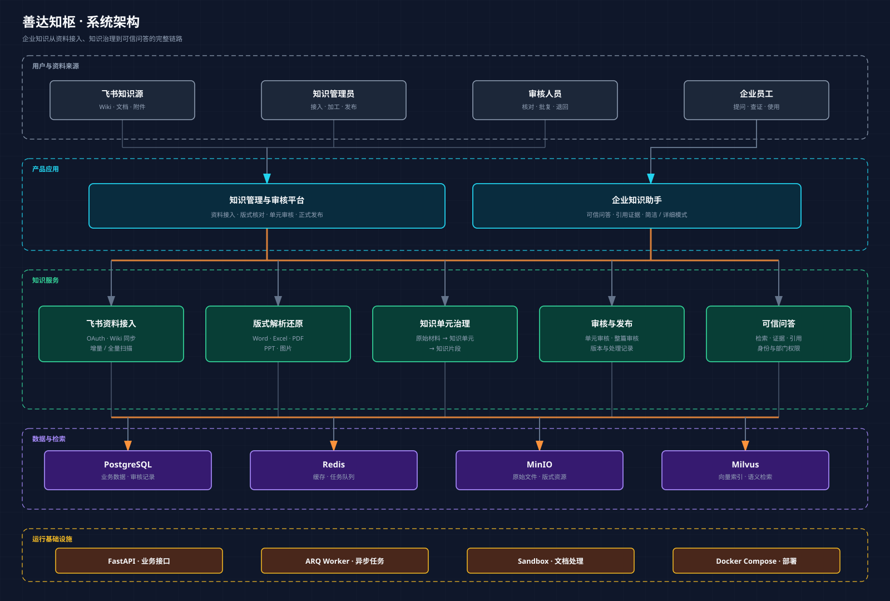

  
  <h1>善达知枢</h1>
  
<strong>企业知识治理与可信知识助手平台</strong>

  
让企业资料从接入、加工、审核到发布形成可追溯闭环，并以可核对的引用支撑每一次回答。

  
  
  

  [文档中心](https://chif-1980.github.io/sdkb/) · [产品概览](https://chif-1980.github.io/sdkb/guide/overview) · [知识加工指南](https://chif-1980.github.io/sdkb/guide/knowledge-processing)

## 产品定位

善达知枢面向企业内部知识管理场景，将分散的原始资料加工为可审核、可发布、可追溯的正式知识，并通过独立的企业知识助手向员工提供有来源依据的回答。

系统包含两个主要入口：

| 产品入口 | 面向角色 | 主要工作 |
| --- | --- | --- |
| 知识管理与审核平台 | 知识管理员、审核人员 | 资料接入、知识加工、版式核对、单元审核、整篇审核、正式发布 |
| 企业知识助手 | 企业员工 | 检索已发布知识、查看引用证据、获取简洁或详细回答 |

## 知识模型

系统以 **知识单元** 作为主要管理和审核粒度：

`原始材料` → `知识单元` → `知识片段`

- **原始材料** 保留文件、飞书来源、版本及版式信息。
- **知识单元** 表达一个相对完整、可独立审核和更新的知识主题。
- **知识片段** 服务于检索和定位，并回溯到所属知识单元和原始版面。

局部内容变化时只需更新对应知识单元；资料结构或主体内容发生较大变化时，可重新加工整份原始材料。

## 核心能力

- **飞书资料接入**：支持企业知识源授权、同步、增量扫描与来源追溯。
- **多格式版式还原**：支持 Word、Excel、PDF、PPT 和图片内容的直观查看与定位。
- **知识单元治理**：围绕知识单元完成编辑、保留、不纳入、退回修改和发布。
- **单元与整篇审核**：既可处理当前知识单元，也可对整份资料执行批量审核。
- **跨文档证据核对**：定位重复或冲突内容，并在对应版式中高亮证据。
- **可信知识问答**：只检索已发布知识，返回可打开、可核对的引用来源。
- **企业权限控制**：结合飞书身份与部门关系限制知识访问范围。

## 系统架构

系统按照用户入口、应用、知识服务、数据与运行基础设施分层。资料进入后依次经过解析、知识单元治理和人工审核，只有正式发布的内容才进入企业知识助手的检索与回答链路。

## 技术组成

| 层级 | 主要技术与组件 |
| --- | --- |
| 应用端 | Vue 3 管理审核端、React 企业知识助手 |
| 服务端 | FastAPI、知识加工与治理服务、RAG 问答与引用服务 |
| 异步任务 | ARQ Worker、Redis |
| 数据与文件 | PostgreSQL、MinIO、Milvus |
| 运行环境 | Docker Compose、文档解析与沙盒服务 |

## 使用与部署

- [产品概览](https://chif-1980.github.io/sdkb/guide/overview)
- [知识加工](https://chif-1980.github.io/sdkb/guide/knowledge-processing)
- [审核与发布](https://chif-1980.github.io/sdkb/guide/review-and-publish)
- [知识助手](https://chif-1980.github.io/sdkb/guide/knowledge-assistant)
- [部署与运维说明](docs/implementation/enterprise-assistant-operations.md)

生产环境的飞书凭据、模型密钥和加密密钥只应保存在部署机器的本地环境文件或密钥管理系统中，不应提交到仓库。

## 当前版本

`v0.2.0-rc.1` 是善达知枢治理自动化候选版本，覆盖运营待办、质量门禁、来源变化摘要、加工重试、反馈回流，以及资料队列分块统计、扫描进度和扫描期间读写边界优化。正式 `v0.2.0` 将在真实多格式端到端验收完成后发布。

## 开源说明

本项目基于成熟的开源能力持续演进，新增企业知识接入、知识单元治理、人工审核与独立知识助手等产品化实现。感谢相关开源项目与社区。

项目许可见 [LICENSE](LICENSE)。
